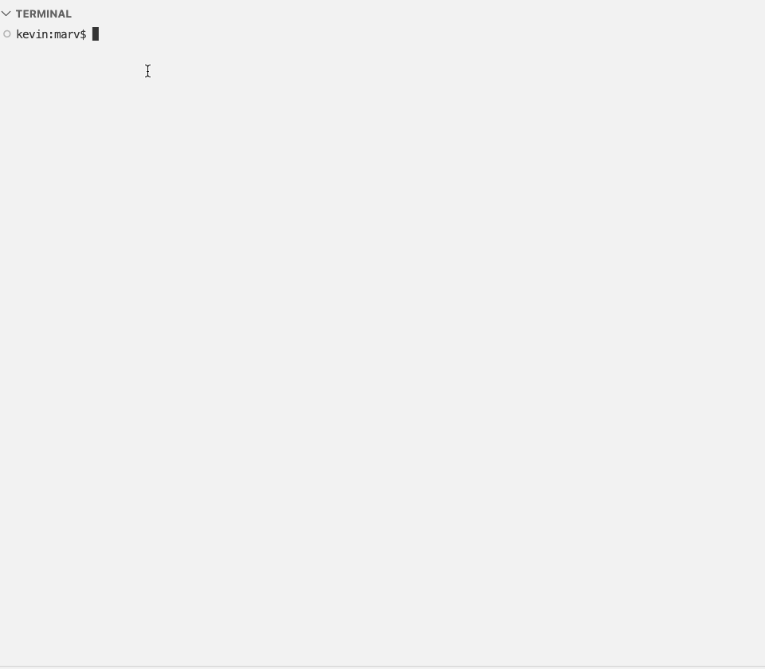

# Introduction

`marv` is an Infrastructure-as-Code tool for declaring and managing cloud
resources.

You define your infrastructure in files using Marv's DSL, and then apply the
definition which creates/updates/deletes the actual resources. `marv` manages
the lifecycle of the resources to keep the infrastructure in sync with code.



# Status

__Under active development: Not suitable for production usage__

## Features so far...

- Support for GCP Compute, Storage and (partial) IAM APIs (more planned soon)
- New DSL for describing resources
- Modules, including parameters and returns (outputs)
- Custom types (for accessing parts of the API not covered in the standard model)
- Local state file

You could play with this locally in your own GCP projects etc. It might be
useful for managing small development environments; you would have to manage the
state file locally.

The code is not in the best of places - consider it very 'prototypey' :)
(it is improving).

This is my first major project using Racket, which I'm still learning, so the
structure of it is very much in-flux and subject to __significant__ change. 

## Current Limitations

There's a lot of work left to reach a good beta release point. The main issues
and omissions are:

- A new DSL subject to change, and very lacking in features, such as loops and
conditions. All are planned though.

- Limited API support (compute, storage, and some IAM coverage)

- The model doesn't yet know about which fields are immutable on GCP resources; you
need to specify these manually (see attributes marked `imm:` in the
[examples](examples/gcp/shared/network-base.mrv)).

- Bare-bones error checking, and error reports are often obtuse. A lot of times
errors aren't caught until GCP sees the configuration during an `apply` phase. 

- Only supports local state files

# Installation 

## Linux & Mac

Install Racket from: https://download.racket-lang.org

Install `marv` using `raco`:

    # From the root of the cloned project:
    raco pkg install

## Docker Image

Marv is available as a pre-built docker image:

    docker pull happyrat/marv:latest

The image contains the [Google cloud SDK](https://cloud.google.com/sdk) i.e the
`gcloud` command is available. You will need to `gcloud auth login` from inside
the container, or arrange authentication via some other method.

To build the image locally:

    ./build.sh [TAG]  # TAG defaults to 'latest'

`marv` is available as an installed command when running in the container e.g.:

    docker run -it happyrat/marv:latest /bin/bash
    .. [ set up environment - see below ]
    marv --plan /usr/lib/marv/examples/gcp/01-networking.mrv

    # or:
    # Mount local directory (to save state - cd to /home/marv) 
    # and pass environment into container

    docker run -v `pwd`:/home/marv \
        -e GCP_ACCESS_TOKEN=$GCP_ACCESS_TOKEN \
        -e MARV_GCP_PROJECT=$MARV_GCP_PROJECT \
        -e MARV_GCP_REGION=$MARV_GCP_REGION \
        -it happyrat/marv:latest /bin/bash

# Command line usage
```
alias marv="racket command.rkt" # (not needed in docker container)
marv -h
usage: command.rkt [ <option> ... ] <module-file>

<option> is one of

  -s <state-file>, --state <state-file>
     Name of statefile to use
  --purge
     Purge (DELETE) all resources
/ --plan
|    Plan changes
| --apply
|    Apply resources
| --list
|    Show the defined resources
| --state-ids
|    List resource IDs from state
| --dump
|    Dump full output of resources from state
| --import <ids>
|    Import the already existing resource IDs into state
| --state-rm <id>
|    Remove item from state
| --list-params
\    Lists parameters accepted by module
* --param <param> <value>
     Set <param> to <value>
  --help, -h
     Show this help
  --
     Do not treat any remaining argument as a switch (at this level)

 *   Asterisks indicate options allowed multiple times.
 /|\ Brackets indicate mutually exclusive options.

 Multiple single-letter switches can be combined after
 one `-`. For example, `-h-` is the same as `-h --`.
 ```
    
# Marv's DSL (marv-speak)

Start by looking at the [first example](examples/gcp/01-networking.mrv), and
follow the trail from there into the [network-base
module](examples/gcp/shared/network-base.mrv).

The marv language specification is written in
[brag](https://docs.racket-lang.org/brag/index.html) and is [defined
here](alpha/parser.rkt).

# Running the example

    # GCP project must already exist
    export MARV_GCP_PROJECT=...
    export MARV_GCP_REGION=europe-west1

    # Take care that you refresh the token regularly - it expires after 1 hour
    # and may leave a partial-application if it expires during a run
    
    export GCP_ACCESS_TOKEN=`gcloud auth print-access-token`

    alias marv="racket command.rkt"

    # NB '--plan' doesn't actually output a plan-file, it just previews the changes.
    marv --plan examples/gcp/01-networking.mrv
    marv --apply examples/gcp/01-networking.mrv

    # Delete all resources
    marv --purge --apply examples/gcp/01-networking.mrv

The state is stored locally in `01-networking.state.dat` by default. Use `-s` to
override this.

Cached information is held in the `.marv` directory - this is mainly for holding
downloaded GCP API schema information.

# Notes

## Build a standalone
(deprecated)

    raco exe ++lib net/http-easy ++lang racket/base --collects-path ./ -o marv command.rkt